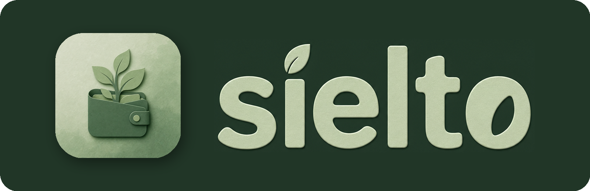

<p align="center">
  
</p>

<p align="center">
  <b>A simple space for complicated money.</b><br>
  Plan what you have to pay, and see what you can actually spend.
</p>

<p align="center">
  <a href="https://github.com/edvigsmirnov/sielto-app/actions/workflows/ci.yml"></a>
  
  
  <a href="LICENSE"></a>
</p>

---

Sielto answers one question: **how much can I actually spend?** It takes the
money you have, subtracts everything you've planned to pay, including the bills
that only land at the end of the month, and shows you what's left.

It doesn't connect to your bank. You enter every figure yourself, so it works
the same for a salary, freelance income that comes and goes, or a trip with
friends.

## Your money, your device

- **No account.** No email, no phone number, no password. You pick a name, and
  that's it.
- **Nothing is collected.** No telemetry, no ads, no analytics.
- **Works offline.** Everything lives in an encrypted database on your device.
- **Hard to lose.** A Recovery Key opens your data on a new device, and even we
  can't open it without that key.

## Three ways to budget

Each Space is one budget with its own type, so home, a trip and freelance work
don't get mixed up.

- **Regular income.** For a household with a salary or a stipend. Periods run
  from one payday to the next on their own, and a payday that lands on a
  weekend or a holiday moves to the nearest working day.
- **Flow.** For irregular income, or when you just want to see ahead. Start
  from the money you have now and watch how far it goes.
- **Budget.** For a goal or an event. Set an amount, a date or both, record
  what you spend, and see whether you're staying within it.

## Everything in one place

- **Dashboard.** One figure for what you can spend, with a short explanation
  in your own numbers of how it was worked out.
- **Feed.** Every payment and income in date order, past and planned. Swipe to
  mark something paid, drag to set what gets covered first when money runs
  short, and search or filter when the list grows long.
- **Calendar.** Day, week, month and year views, with non-working days,
  holidays and busy spending days marked.
- **Analytics.** Where the money went, by category or by name, over any range
  of dates you choose.
- **Regular payments.** Monthly, weekly, on working days or on your own
  schedule. Change one date or everything from now on.
- **Holidays for 204 countries**, including regional ones, built in and
  available offline. Add your own days off too.

## Safe by default

- The database is encrypted with SQLCipher, and its key stays in your
  system's secure storage.
- Lock the app with a PIN or biometrics. On Android you can also keep it out
  of screenshots and the recent apps view.
- Back up to a file you keep, or to your own Google Drive once a day. Restore
  it on any device, or import it as a copy next to what you already have.

Available in English and Russian, in light and dark.

## Status

Early development, version 0.7. There's no release yet, but every CI run
builds test packages for Android, Windows and Linux. Next up is cloud sync, so
you can share a Space with your family or friends.

Apple platforms are out of scope for now.

## Building

You'll need the Flutter SDK on `stable`. Android builds also need JDK 17 and
the Android SDK. Windows needs the Visual Studio C++ build tools, including the
ATL component. Linux needs the GTK development headers and `libsecret-1-dev`.

```sh
flutter pub get
flutter run -d linux            # or: -d windows, -d <your android device>

flutter build apk --release
flutter build windows --release
flutter build linux --release
```

On Windows, enable Developer Mode first. Flutter needs it to create the plugin
symlinks, and every build fails without it.

### Linux packages

Releases carry a `.deb`, an `.rpm`, a `.tar.gz` and an AppImage. To build them
from a release bundle:

```sh
flutter build linux --release
tools/package_linux.sh 0.7.0 1
```

You'll need `dpkg-deb` and `tar`. `rpmbuild` and `appimagetool` are optional,
and their formats are skipped when they're missing. At runtime the app needs
GTK 3 and libsecret. libsecret keeps the database key in the desktop keyring,
and when there's no keyring the app asks for a passphrase instead.

## License

Source-available, non-commercial. See [LICENSE](LICENSE) for the full terms.
